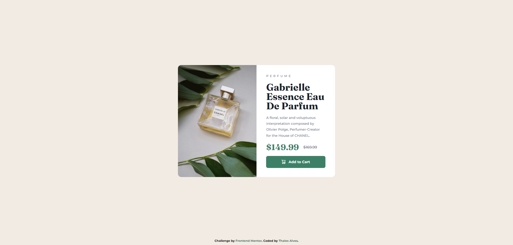

# Frontend Mentor - Product preview card component

Esta é uma solução para o desafio [Product preview card component no Frontend Mentor](https://www.frontendmentor.io/challenges/product-preview-card-component-GO7UmttRfa). Os desafios do Frontend Mentor ajudam você a melhorar suas habilidades de codificação, construindo projetos realistas.

## Índice

- [Visão Geral](#visão-geral)
  - [O desafio](#o-desafio)
  - [Captura de tela](#captura-de-tela)
    - [Desktop Layout](#desktop-layout)
    - [Mobile Layout](#mobile-layout)
- [Meu processo](#meu-processo)
  - [Construído com](#construido-com)
- [Autor](#autor)

## Visão Geral

### O desafio

Os usuários devem ser capazes de:

- Visualizar o layout ideal, dependendo do tamanho da tela do dispositivo
- Ver os estados de foco e hover para elementos interativos

### Captura de tela

#### Desktop Layout

#### Mobile Layout

## Meu processo

### Construído com

- CSS Custom properties
- Flexbox
- CSS Grid

## Autor

- Frontend Mentor - [@thalesAlves758](https://www.frontendmentor.io/profile/thalesAlves758)
- GitHub - [@thalesAlves758](https://github.com/thalesAlves758)
